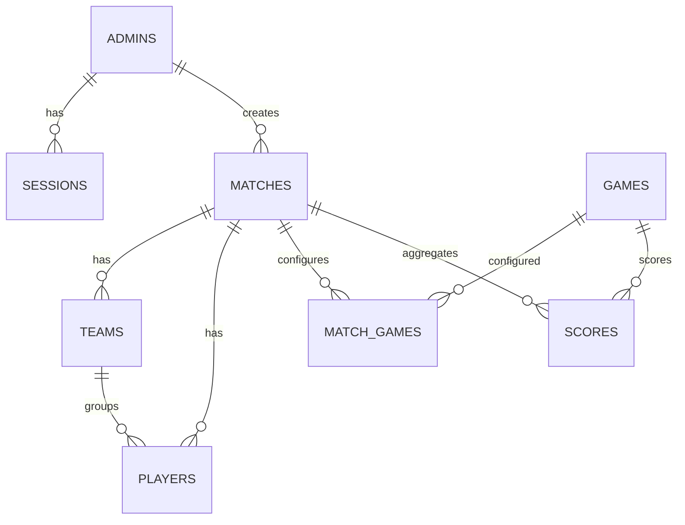

# Base de datos

El esquema esta en `backend/sql/schema.sql` y usa MySQL 8+.

## Entidades principales
- `admins`: administradores del sistema.
- `sessions`: refresh tokens activos por admin.
- `matches`: partidas creadas por admins.
- `games`: catalogo de minijuegos.
- `match_games`: relacion partidas <-> juegos con habilitado.
- `teams`: equipos por partida.
- `players`: jugadores por partida (opcionalmente en equipo).
- `scores`: puntos por jugador y juego.

## Relaciones

## Notas de integridad
- `players.team_id` usa `ON DELETE SET NULL`.
- `matches` y `scores` usan `ON DELETE CASCADE`.
- Los nombres de equipos y jugadores son unicos por partida.
