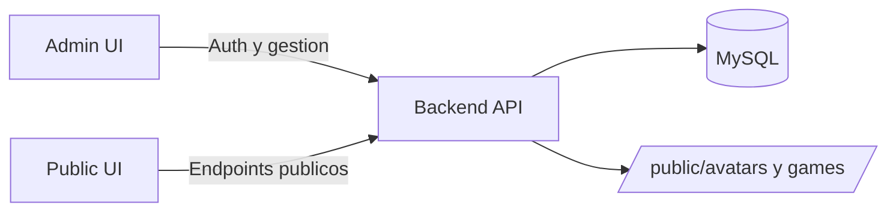

# Vision general

Brain Fighters es una plataforma para gestionar partidas con minijuegos de entrenamiento cognitivo. Hay dos perfiles claros.

## Roles
- Admin: crea partidas, configura jugadores/equipos y habilita juegos.
- Jugador: accede por URL publica, elige un juego y envia puntuaciones.

## Flujo principal
- El admin se registra o inicia sesion.
- Crea una partida (maximo 3 activas por admin).
- Configura jugadores, equipos y juegos habilitados.
- Comparte la URL publica `/play/:publicCode`.
- Los jugadores seleccionan nombre y juego, juegan y envian puntos.
- La vista publica muestra la clasificacion individual y por equipos.

## Arquitectura

## Puntos clave
- Autenticacion con JWT de acceso y refresh token via cookie httpOnly.
- Activos estaticos servidos desde `/avatars` y `/games`.
- La logica de negocio vive en el backend y se consume via REST.
